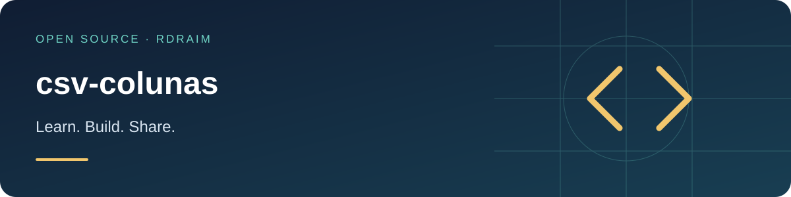

<p align="right">
  <a href="README.md"></a>
  <a href="README.en-US.md"></a>
  <a href="README.es-AR.md"></a>
</p>

# csv-colunas



<!-- public-badges:start -->
[](LICENSE) [](https://github.com/Rdraim/csv-colunas/actions) [](https://github.com/Rdraim/csv-colunas/releases) [](https://github.com/Rdraim/csv-colunas/commits/main)
<!-- public-badges:end -->

<p>
  <a href="https://github.com/Rdraim/csv-colunas/tree/main/examples"></a>
  <a href="https://github.dev/Rdraim/csv-colunas"></a>
  <a href="https://github.com/Rdraim/csv-colunas/archive/refs/heads/main.zip"></a>
</p>


A CSV reader that copes with the **quirks of each source**: quotes, mixed separators, BOM, headers that move and rename themselves. Pure logic, zero dependencies, Node and browser.

## Why

CSV files rarely arrive in the same shape. One source uses commas with escaped quotes; another uses semicolons and starts with a BOM; another exports headers with bracketed suffixes (`Name [READ ONLY]`); sometimes there is a line break **inside** a quoted field. And column order changes between exports — the name does not.

`csv-colunas` handles that: it detects the separator, strips the BOM, honors quotes (including embedded newlines and `""` escaping), normalizes headers and finds columns by **approximate name**. It also returns **per-line diagnostics** and enforces an explicit **size limit**.

## Install

```bash
git clone https://github.com/Rdraim/csv-colunas.git
cd csv-colunas
npm test
```

Or copy `src/index.js` — a dependency-free ESM module.

## Usage

```js
import { lerCSV, col } from './src/index.js';

const { cabecalho, registros, separador, erros } = lerCSV(text);

for (const r of registros) {
  const name  = col(r, 'nome', 'name');     // by name, not by position
  const price = col(r, 'preço unitário', 'price');
  // r.__linha = line number in the original file
}
```

Each record is an object keyed by **normalized header names**. `col()` matches by exact name, then by inclusion, accepting several alternative names.

## API

| function | description |
|---|---|
| `lerCSV(text, { separador?, limiteBytes? })` | `{ cabecalho, chaves, registros, separador, erros }` |
| `registrosDeMatriz(matrix)` | same output from a matrix of cells (e.g. a spreadsheet API) |
| `col(record, ...names)` | first value whose column matches (exact → inclusion) |
| `dividirLinha(line, sep)` | split a line honoring quotes |
| `separarLinhas(text)` | split into lines without breaking quotes |
| `normalizarChave(name)` | strip `[TAGS]`, accents, case and punctuation |
| `detectarSeparador(firstLine)` | `,` `;` or `\t` |

`erros` lists rows whose column count differs from the header (`{ linha, esperado, encontrado }`); the row **still goes** into `registros`, so nothing is lost silently. `lerCSV` throws `RangeError` when the text exceeds `limiteBytes` (default 20 MB).

## Limitations

- Returns **strings**: no number, date or currency conversion (pair it with a separate parser).
- `__linha` is the physical line in the file; fully empty lines are skipped.
- No streaming: it reads the whole text in memory (hence the size limit).

## Tests

```bash
node --test
```

## License

MIT © Rodrigo Rodrigues

## ☕ Buy me a coffee

Did this project help you solve a problem, learn something new, or take your first steps in development? If you feel like supporting my work, a coffee is a kind way to say thank you.

I’m **Rodrigo Rodrigues**, creator of **Nexus** and these open source projects. Your support helps me set aside time to improve the code, write clearer examples, and keep sharing what I learn.

**Give any amount that feels right to you. Supporting is completely optional — the project remains free under the MIT license.**

<p>
  <a href="#support-via-pix"></a>
  <a href="https://github.com/Rdraim/csv-colunas/issues/new?title=Feedback%3A%20this%20project%20helped%20me"></a>
</p>

### Support via Pix

In your banking app, scan the QR code or copy the Pix key below. Choose your amount and check the recipient details before confirming.

<p align="center">
  
</p>

**Pix key**

```text
8875a24e-44d1-4c91-b6bb-62c9f0070955
```

Pix is Brazil’s payment system. If your bank does not support it, you can still help by sharing the project, reporting a bug, improving the documentation, or leaving feedback.

### Your feedback matters, too

[Tell me how the project helped you](https://github.com/Rdraim/csv-colunas/issues/new?title=Feedback%3A%20this%20project%20helped%20me). I’d love to hear what you built, what you learned, and what could be clearer for someone just starting out.

A comment is welcome with or without a donation. Please keep payment receipts, personal details, credentials and private user data out of public Issues.

---

**Thank you for supporting my work and helping me keep building and sharing. ❤️**
