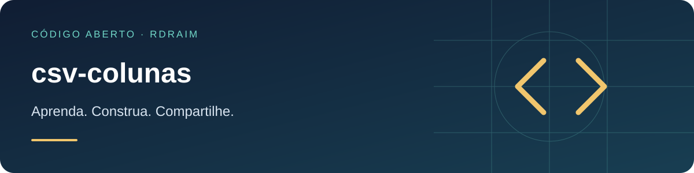

<p align="right">
  <a href="README.md"></a>
  <a href="README.en-US.md"></a>
  <a href="README.es-AR.md"></a>
</p>

# csv-colunas



<!-- public-badges:start -->
[](LICENSE) [](https://github.com/Rdraim/csv-colunas/actions) [](https://github.com/Rdraim/csv-colunas/releases) [](https://github.com/Rdraim/csv-colunas/commits/main)
<!-- public-badges:end -->

<p>
  <a href="https://github.com/Rdraim/csv-colunas/tree/main/examples"></a>
  <a href="https://github.dev/Rdraim/csv-colunas"></a>
  <a href="https://github.com/Rdraim/csv-colunas/archive/refs/heads/main.zip"></a>
</p>


Leitor de CSV que aguenta as **manias de cada origem**: aspas, separador variado, BOM, cabeçalhos que mudam de posição e de nome. Lógica pura, sem dependências, Node e navegador.

## Por quê

Arquivos de CSV raramente vêm no mesmo formato. Uma origem usa vírgula com aspas escapadas; outra usa ponto e vírgula e começa com BOM; outra exporta cabeçalhos com sufixos entre colchetes (`Nome [READ ONLY]`); às vezes há quebra de linha **dentro** de um campo entre aspas. E a posição das colunas muda entre exportações — o nome, não.

`csv-colunas` resolve isso: detecta o separador, remove o BOM, respeita aspas (inclusive quebras de linha e `""` escapado), normaliza cabeçalhos e acha coluna por **nome aproximado**. Ainda devolve **diagnóstico por linha** e impõe um **limite de tamanho** explícito.

## Instalação

```bash
git clone https://github.com/Rdraim/csv-colunas.git
cd csv-colunas
npm test
```

Ou copie `src/index.js` — módulo ESM sem dependências.

## Uso

```js
import { lerCSV, col } from './src/index.js';

const { cabecalho, registros, separador, erros } = lerCSV(texto);

for (const r of registros) {
  const nome  = col(r, 'nome');                 // por nome, não por posição
  const preco = col(r, 'preço unitário', 'preco');
  // r.__linha = número da linha no arquivo original
}
```

Cada registro é um objeto com as **chaves normalizadas** do cabeçalho. `col()` busca a coluna por nome exato e, se não achar, por inclusão — aceitando vários nomes alternativos.

## API

| função | descrição |
|---|---|
| `lerCSV(texto, { separador?, limiteBytes? })` | `{ cabecalho, chaves, registros, separador, erros }` |
| `registrosDeMatriz(matriz)` | mesma saída, a partir de uma matriz de células (ex.: API de planilha) |
| `col(registro, ...nomes)` | primeiro valor cuja coluna bata (exato → inclusão) |
| `dividirLinha(linha, sep)` | divide uma linha respeitando aspas |
| `separarLinhas(texto)` | quebra em linhas sem cortar aspas |
| `normalizarChave(nome)` | tira `[TAGS]`, acentos, caixa e pontuação |
| `detectarSeparador(primeiraLinha)` | `,` `;` ou `\t` |

`erros` lista linhas cuja contagem de colunas difere do cabeçalho (`{ linha, esperado, encontrado }`); a linha **ainda entra** em `registros`, para não perder dado em silêncio. `lerCSV` lança `RangeError` quando o texto passa de `limiteBytes` (padrão 20 MB).

## Limitações

- Entrega **strings**: não converte número, data nem moeda (combine com um parser à parte).
- `__linha` é a linha física no arquivo; linhas totalmente vazias são ignoradas.
- Não faz streaming: lê o texto inteiro em memória (por isso o limite de tamanho).

## Testes

```bash
node --test
```

## Licença

MIT © Rodrigo Rodrigues

## ☕ Me pague um café

Este projeto te ajudou a resolver um problema, aprender algo novo ou dar os primeiros passos no desenvolvimento? Se você sentir vontade de apoiar meu trabalho, um café é uma forma carinhosa de agradecer.

Sou **Rodrigo Rodrigues**, criador do **Nexus** e destes projetos de código aberto. Seu apoio me ajuda a dedicar tempo para melhorar o código, escrever exemplos mais claros e continuar compartilhando o que aprendo.

**Contribua com o valor que fizer sentido para você. O apoio é totalmente voluntário — o projeto continua gratuito sob a licença MIT.**

<p>
  <a href="#apoie-com-pix"></a>
  <a href="https://github.com/Rdraim/csv-colunas/issues/new?title=Coment%C3%A1rio%3A%20este%20projeto%20me%20ajudou"></a>
</p>

### Apoie com Pix

No aplicativo do seu banco, escaneie o QR Code ou copie a chave Pix abaixo. Escolha o valor e confira os dados do destinatário antes de confirmar.

<p align="center">
  
</p>

**Chave Pix**

```text
8875a24e-44d1-4c91-b6bb-62c9f0070955
```

Você também pode apoiar compartilhando o projeto, relatando um problema, melhorando a documentação ou deixando um comentário.

### Seu comentário também faz diferença

[Conte como o projeto te ajudou](https://github.com/Rdraim/csv-colunas/issues/new?title=Coment%C3%A1rio%3A%20este%20projeto%20me%20ajudou). Vou gostar de saber o que você criou, o que aprendeu e o que poderia ficar mais claro para quem está começando.

O comentário é bem-vindo com ou sem doação. Preserve sua privacidade: não publique comprovantes, dados pessoais, credenciais ou informações de usuários nas Issues.

---

**Obrigado por apoiar meu trabalho e me ajudar a continuar criando e compartilhando. ❤️**
